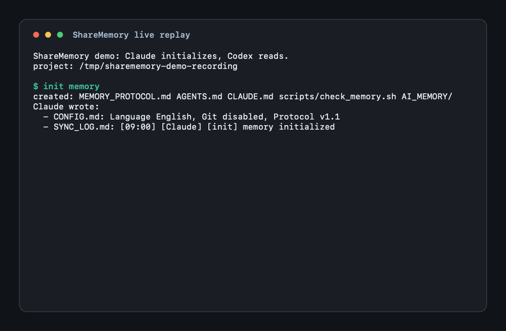

<div align="center">

# ShareMemory

[English](README.md) | [中文](README.zh.md)

> *Your agents forget everything between sessions - and they have never met each other.*

**Project-scoped shared memory for AI coding agents,
packaged as a single skill that works in both Claude Code and Codex.**

[](https://github.com/ycl-2004/ShareMemory/actions/workflows/ci.yml) [](https://skills.sh/ycl-2004/ShareMemory/share-memory) [](LICENSE) [](https://code.claude.com/docs/en/skills) [](https://developers.openai.com/codex/skills) [](templates/project/MEMORY_PROTOCOL.md) [](#requirements) [](#contributing)

**One `AI_MEMORY/` folder turns isolated Claude Code and Codex sessions into a shared, linted project handoff loop.**

[See it run](#see-it-in-action) · [Install](#30-second-quick-start) · [Use it daily](#daily-usage) · [Design details](PROJECT_DETAILS.md) · [Verify it](#verification) · [Safety](#conflict--safety-rules)

</div>

---

Claude Code and Codex do not share context. When both agents work in the same repository, each is blind to the other's decisions, and every new session starts from zero. ShareMemory solves this with a **file-based single source of truth** (`AI_MEMORY/`) inside each project: both agents are bound by the same protocol to read it on startup and write to it as they work — so each agent always sees what the other one did.

## See It in Action

<div align="center">

</div>

## 30-Second Quick Start

Recommended for this project: install one repo-local copy for Codex, then expose the same copy to Claude Code.

```bash
# Run inside the repo where you want both agents to use ShareMemory
npx skills add ycl-2004/ShareMemory --skill share-memory --agent codex --copy --yes
mkdir -p .claude/skills
ln -s ../../.agents/skills/share-memory .claude/skills/share-memory
```

Codex reads repo skills from `.agents/skills/`. Claude Code reads project skills from `.claude/skills/`. The symlink keeps both agents on the same ShareMemory code in that repo.

Or install manually without Node.js:

```bash
mkdir -p .agents/skills .claude/skills
git clone https://github.com/ycl-2004/ShareMemory .agents/skills/share-memory
ln -s ../../.agents/skills/share-memory .claude/skills/share-memory
```

Then open that repo in Claude Code or Codex and say **`init memory`**. Open the same folder with the other agent and it will read the same `AI_MEMORY/` state instead of starting from zero.

**Verify it worked** — after `init memory`, paste this into either agent:

> memory status

Expected: a status report showing protocol version, language, git setting, and the init log entry.

MIT licensed. No runtime dependencies. One shared memory per repo.

## What You Get

- One project-local `AI_MEMORY/` folder shared by Claude Code and Codex.
- A small protocol for startup reads, daily handoffs, decisions, tasks, learnings, and corrections.
- A write lock plus `scripts/check_memory.sh` so memory stays small, signed, and linted.
- Optional git recovery for `AI_MEMORY/` history.

## Install

### Codex + Claude Code

```bash
npx skills add ycl-2004/ShareMemory --skill share-memory --agent codex --copy --yes
mkdir -p .claude/skills
ln -s ../../.agents/skills/share-memory .claude/skills/share-memory
```

Run this from the repo that should use shared memory. Codex reads `.agents/skills/share-memory`; Claude Code reads the symlinked `.claude/skills/share-memory`. Both use one project-local skill copy.

### Codex only

```bash
npx skills add ycl-2004/ShareMemory --skill share-memory --agent codex --copy --yes
```

```text
.agents/skills/share-memory/SKILL.md
```

### Claude Code only

```bash
npx skills add ycl-2004/ShareMemory --skill share-memory --agent claude-code --copy --yes
```

```text
.claude/skills/share-memory/SKILL.md
```

### Manual, no Node.js

Shared copy:

```bash
mkdir -p .agents/skills .claude/skills
git clone https://github.com/ycl-2004/ShareMemory .agents/skills/share-memory
ln -s ../../.agents/skills/share-memory .claude/skills/share-memory
```

### Optional personal global install

Use this on your own machine when you want `init memory` available in any project. The skill is global; each project's `AI_MEMORY/` is still separate.

```bash
mkdir -p ~/.claude/skills ~/.agents/skills
git clone https://github.com/ycl-2004/ShareMemory ~/.claude/skills/share-memory
ln -sfn ~/.claude/skills/share-memory ~/.agents/skills/share-memory
```

Update it with:

```bash
git -C ~/.claude/skills/share-memory pull --ff-only
```

## Updating ShareMemory

The update path depends on how the skill was installed.

### If you installed with `npx skills add --copy`

`--copy` creates a project-local copy of the skill, not a git checkout. To update it, rerun the same install command from the target repo. The Claude symlink can stay in place.

Codex + Claude Code shared copy:

```bash
npx skills add ycl-2004/ShareMemory --skill share-memory --agent codex --copy --yes
mkdir -p .claude/skills
ln -sfn ../../.agents/skills/share-memory .claude/skills/share-memory
```

Codex only:

```bash
npx skills add ycl-2004/ShareMemory --skill share-memory --agent codex --copy --yes
```

Claude Code only:

```bash
npx skills add ycl-2004/ShareMemory --skill share-memory --agent claude-code --copy --yes
```

After updating, ask either agent:

> memory status

It should report the current protocol version and recent handoff state.

### If you installed with `git clone`

Pull the cloned skill directory. For the recommended shared install, only the canonical Codex copy needs a pull:

```bash
git -C .agents/skills/share-memory pull --ff-only
```

If you cloned separate Codex and Claude Code copies, update both:

```bash
git -C .agents/skills/share-memory pull --ff-only
git -C .claude/skills/share-memory pull --ff-only
```

## Daily Usage

| Command | Use it when |
|---|---|
| `init memory` | First time in a project. Creates protocol files, boot files, lint script, and empty `AI_MEMORY/`. |
| `update memory` | Record task progress for the next agent. |
| `memory status` | See current project state and what the other agent changed recently. |
| `consolidate memory` | Compress stale or duplicated memory while keeping startup cost stable. |
| `repair memory` | Fix drift: missing `@AGENTS.md` import, duplicate/broken marker blocks, missing files. |

These phrases trigger the skill implicitly on both platforms. In Codex you can also invoke it explicitly by typing `$share-memory` (or by finding `share-memory` via `/skills`, depending on the client). Claude Code picks it up automatically from the skill description. `AI_MEMORY/` is only the per-project data folder created by init; the skill id is `share-memory`.

During init, the skill asks two questions: memory language (中文 / English / bilingual) and whether to enable the git recovery layer. Existing `CLAUDE.md` / `AGENTS.md` files are never overwritten — ShareMemory content lives in a bounded `<!-- SHAREMEMORY:START/END -->` marker block that init inserts or replaces (with a backup), so repeated runs stay clean. `CLAUDE.md` follows [Anthropic's recommended pattern](https://code.claude.com/docs/en/memory): one `@AGENTS.md` import plus Claude-specific notes, so the shared rules exist in exactly one place.

## What `init` adds to your project

| File | Purpose | Written |
|---|---|---|
| `MEMORY_PROTOCOL.md` | The shared rule set both agents follow | once |
| `AGENTS.md` | Shared agent-neutral boot rules (Codex reads natively; Claude imports it) | managed marker block |
| `CLAUDE.md` | `@AGENTS.md` import + Claude-only notes (incl. auto-memory policy) | managed marker block |
| `scripts/check_memory.sh` | Post-write lint + secrets scan | once |
| `AI_MEMORY/CONFIG.md` | Language, git choice, protocol version | on init |
| `AI_MEMORY/PROJECT.md` | Overview, architecture, **Long-Term Memory** (distilled current state) | auto, on structural change |
| `AI_MEMORY/DECISIONS.md` | Decisions and dependency changes (max 5) | **auto** |
| `AI_MEMORY/TASKS.md` | Active and recently completed tasks | auto for handoff-critical state; manual cleanup |
| `AI_MEMORY/LEARNINGS.md` | Lessons worth keeping (max 5) | auto for confirmed reusable lessons; manual curation |
| `AI_MEMORY/SYNC_LOG.md` | Daily handoff blocks — how the agents see each other without noisy per-write logs | every write session |
| `AI_MEMORY/archive/` | Overflowed entries and old logs | on overflow |

Durable entries are signed `[YYYY-MM-DD HH:MM] [Claude|Codex]` with real system time. `SYNC_LOG.md` keeps at most one compact block per date.

## What Gets Written Automatically

- Decisions, dependency/tooling changes, install or publishing contracts → `DECISIONS.md`.
- Project direction, architecture, workflow, or startup summary changes → `PROJECT.md`.
- Handoff-critical task state → `TASKS.md`.
- Confirmed reusable lessons or validation traps → `LEARNINGS.md`.
- Completed work → today's `SYNC_LOG.md` block.

If it would not change what the next agent does, it should not become durable memory.

## Verification

| Check | What it proves |
|---|---|
| `bash assets/demo.sh` | Demo project initializes and passes memory lint |
| `bash scripts/check_memory.sh` | Current project memory is valid |
| CI | Template, boot, protocol, and secret-scan checks |

Run locally:

```bash
bash assets/demo.sh
bash scripts/check_memory.sh
```

## Conflict & Safety Rules

- User instruction wins; agents must point out conflicts with memory instead of silently overriding either side.
- Read-only instructions pause all automatic `AI_MEMORY/` writes.
- Memory is not a diary: no raw reasoning, chat dumps, verbose logs, secrets, tokens, or private URLs.
- Do not run both agents on the same project at the same time; the write lock prevents accidental overlap, not live collaboration.
- Publishing a public repo? Treat `AI_MEMORY/` as internal project context unless you intentionally want it public.

## Requirements

**Nothing to install.** The skill is plain Markdown plus one bash script; `init` only copies template files.

| Dependency | Needed for | If missing |
|---|---|---|
| bash + coreutils (`grep`, `awk`, `wc`, `date`, `sort`, `uniq`) | lint script, timestamps | Preinstalled on macOS/Linux; Windows via WSL or Git Bash |
| git *(optional)* | recovery layer for `AI_MEMORY/` history | Everything still works; you lose overwrite recovery |

The skill never auto-installs software. During init it *asks* whether to enable git, records the choice in `CONFIG.md`, and only ever runs `git init` with explicit permission.

## Chinese README

中文说明、安装路径和日常用法见 [README.zh.md](README.zh.md)。

## Contributing

Issues and pull requests are welcome, especially for additional agent boot files, migration helpers, and stronger validation.

## License

[MIT](LICENSE) © 2026 yc星辰

---

<div align="center">

*Built for projects where more than one AI agent needs the same memory.*

</div>
