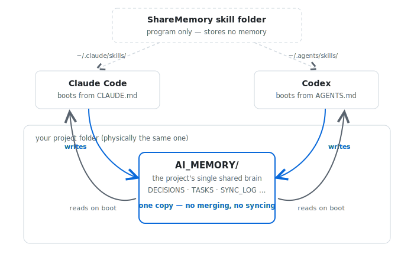

<div align="center">

# ShareMemory

**Project-scoped shared memory for AI coding agents,
packaged as a single skill that works in both Claude Code and Codex.**

[](https://github.com/ycl-2004/ShareMemory/actions/workflows/ci.yml) [](LICENSE) [](https://code.claude.com/docs/en/skills) [](https://developers.openai.com/codex/skills) [](templates/project/MEMORY_PROTOCOL.md) [](#requirements) [](#contributing)

*Your agents forget everything between sessions — and they've never met each other. Fix both with one `git clone`.*

</div>

---

Claude Code and Codex do not share context. When both agents work in the same repository, each is blind to the other's decisions, and every new session starts from zero. ShareMemory solves this with a **file-based single source of truth** (`AI_MEMORY/`) inside each project: both agents are bound by the same protocol to read it on startup and write to it as they work — so each agent always sees what the other one did.

## See It in Action

<div align="center">

</div>

## 30-Second Quick Start

```bash
# Claude Code
git clone https://github.com/ycl-2004/ShareMemory ~/.claude/skills/share-memory

# Codex
mkdir -p ~/.agents/skills
ln -s ~/.claude/skills/share-memory ~/.agents/skills/share-memory
```

Then open any project in Claude Code or Codex and say **`init memory`**. Codex discovers the skill from `~/.agents/skills`; the symlink keeps both agents on the same ShareMemory version. Open the same folder with the other agent and it will read the same `AI_MEMORY/` state instead of starting from zero.

MIT licensed. No runtime dependencies. One real install URL. One shared memory per project.

<details>
<summary><b>📄 What actually got written that Monday (click to expand)</b></summary>

```markdown
<!-- AI_MEMORY/DECISIONS.md -->
### [2026-06-12 14:32] [Claude] Next.js over Vite
SSR required for marketing pages; Vite SPA cannot provide it.

<!-- AI_MEMORY/SYNC_LOG.md -->
## 2026-06-12
- [14:32] [Claude] [DECISIONS.md] switched build to Next.js (SSR)
- [15:10] [Claude] [TASKS.md] scaffolded app router; auth pending
```

Tuesday's boot sequence reads exactly these lines — that's the entire trick. No server, no embeddings, no magic: just files both agents are bound to.

</details>

<div align="center">
<picture>
  <source media="(prefers-color-scheme: dark)" srcset="assets/architecture-dark.svg">
  
</picture>
</div>

> **Design principle** — there is exactly **one** copy of the memory per project. No merging, no sync layer, no split brain: an entry written by one agent is, byte for byte, what the other agent reads.

## Features

| | Feature | Description |
|---|---|---|
| 🧠 | **One shared brain per project** | Both agents read/write the same `AI_MEMORY/` files — communication is guaranteed by "must read on boot, must update the daily handoff" |
| 🔁 | **Daily handoff loop** | Each day has one `SYNC_LOG.md` block; every boot reads the latest 1-2 blocks to see what changed |
| ✍️ | **Auto + manual writes** | Decisions and dependency changes are recorded automatically; task progress on `"update memory"` |
| 🪶 | **Token-frugal by design** | Tiered startup (~a few hundred tokens), telegraphic entries (≤3 lines), 5-entry caps, progressive summarization into Long-Term Memory |
| 🔍 | **Built-in lint** | `check_memory.sh` validates entry caps, daily log shape, header format, and scans for leaked secrets |
| 🔒 | **Lightweight write lock** | `AI_MEMORY/.write.lock` prevents accidental overlapping memory writes without adding a database |
| 🗃️ | **Git recovery layer (opt-in)** | Asked once during init; commits `AI_MEMORY/` history so overwritten content is always recoverable |
| 🔌 | **Agent-agnostic protocol** | Adding a third agent = one boot file pointing at `MEMORY_PROTOCOL.md` |
| 📦 | **Zero dependencies** | Plain Markdown + one bash script; no downloads, no network access, never modifies your system |

## Why Not Just…

| | 🧠 ShareMemory | 📋 Re-explaining in every prompt | 🗄️ Vector-DB memory frameworks |
|---|---|---|---|
| Setup | `git clone` + `init memory` | nothing | server + embeddings + API keys |
| Cross-vendor (Anthropic + OpenAI) | ✅ same plain files | 😓 you are the sync layer | ⚠️ per-framework SDK |
| Dependencies | **zero** | zero | database, SDK, network |
| Token cost per session | ~a few hundred | grows with your patience | retrieval + prompt overhead |
| Human-readable & auditable | ✅ Markdown in your repo, git-diffable | ❌ lives in chat scrollback | ❌ opaque store |
| Decisions survive context loss | ✅ | ❌ | ✅ |
| Right-sized for 2–4 coding agents | ✅ built exactly for this | ❌ | overkill |

ShareMemory deliberately stays small: it's not a memory database, it's a **handoff protocol**. Files your agents are bound to, in the repo you already have.

## Install Options

The fast path above installs one shared skill copy and symlinks Codex to it, so the two platforms never drift.

Prefer fully separate copies?

```bash
# Claude Code
git clone https://github.com/ycl-2004/ShareMemory ~/.claude/skills/share-memory

# Codex
git clone https://github.com/ycl-2004/ShareMemory ~/.agents/skills/share-memory
```

Remember to `git pull` both copies when updating. For a single Claude Code project only, clone into `<project>/.claude/skills/share-memory`.

## Daily Usage

| Command | Use it when |
|---|---|
| `init memory` | First time in a project. Creates protocol files, boot files, lint script, and empty `AI_MEMORY/`. |
| `update memory` | Record task progress for the next agent. |
| `memory status` | See current project state and what the other agent changed recently. |
| `consolidate memory` | Compress stale or duplicated memory while keeping startup cost stable. |

These phrases trigger the skill implicitly on both platforms. In Codex you can also invoke it explicitly by typing `$share-memory` (or via `/skills`); Claude Code picks it up automatically from the skill description.

During init, the skill asks two questions: memory language (中文 / English / bilingual) and whether to enable the git recovery layer. Existing `CLAUDE.md` / `AGENTS.md` files are appended to, never overwritten.

## What `init` adds to your project

| File | Purpose | Written |
|---|---|---|
| `MEMORY_PROTOCOL.md` | The shared rule set both agents follow | once |
| `CLAUDE.md` / `AGENTS.md` | Per-agent boot files (auto-loaded), pointing at the protocol | once |
| `scripts/check_memory.sh` | Post-write lint + secrets scan | once |
| `AI_MEMORY/CONFIG.md` | Language, git choice, protocol version | on init |
| `AI_MEMORY/PROJECT.md` | Overview, architecture, **Long-Term Memory** (distilled current state) | auto, on structural change |
| `AI_MEMORY/DECISIONS.md` | Decisions and dependency changes (max 5) | **auto** |
| `AI_MEMORY/TASKS.md` | Active and recently completed tasks | manual (`update memory`) |
| `AI_MEMORY/LEARNINGS.md` | Lessons worth keeping (max 5) | manual |
| `AI_MEMORY/SYNC_LOG.md` | Daily handoff blocks — how the agents see each other without noisy per-write logs | every write session |
| `AI_MEMORY/archive/` | Overflowed entries and old logs | on overflow |

Durable entries are signed `[YYYY-MM-DD HH:MM] [Claude|Codex]` with real system time. `SYNC_LOG.md` keeps at most one block per date, with compact bullets for that day's handoff. When a memory file exceeds its cap, the oldest content is distilled into Long-Term Memory or archived — the same progressive-summarization pattern used by agent-memory systems such as MemGPT/Letta.

## Conflict & Safety Rules

- **User instructions always win** over memory, but the agent must point out the conflict and confirm before proceeding — then update memory. Neither side is ever silently overridden.
- **Memory is not a diary** — write only facts that change what a future agent should do; raw reasoning, guesses, verbose logs, and obvious code details stay out.
- **Secrets never enter memory** — API keys, credentials, tokens, and private URLs are forbidden and linted for.
- **Do not run both agents simultaneously** on one project. A lightweight lock prevents accidental overlap, and the optional git layer recovers anything that still gets overwritten.
- **Corrections, not edits** — closed daily blocks are immutable; past mistakes are fixed by a `[correction]` bullet in today's block (plus a `supersedes` entry in current views), never by rewriting history.
- **Publishing a public repository?** `AI_MEMORY/` contains your project's internal decisions and plans. Secrets are linted out, but consider adding `AI_MEMORY/` to `.gitignore` if that context should stay private.

## Requirements

**Nothing to install.** The skill is plain Markdown plus one bash script; `init` only copies template files.

| Dependency | Needed for | If missing |
|---|---|---|
| bash + coreutils (`grep`, `awk`, `wc`, `date`, `sort`, `uniq`) | lint script, timestamps | Preinstalled on macOS/Linux; Windows via WSL or Git Bash |
| git *(optional)* | recovery layer for `AI_MEMORY/` history | Everything still works; you lose overwrite recovery |

The skill never auto-installs software. During init it *asks* whether to enable git, records the choice in `CONFIG.md`, and only ever runs `git init` with explicit permission.

## 中文快速开始

本仓库本身就是一个 skill:克隆到 `~/.claude/skills/share-memory`(Claude Code),再用软链接 `ln -s ~/.claude/skills/share-memory ~/.agents/skills/share-memory` 接入 Codex(同一份代码,永不漂移)。之后在任何项目里说「init memory」,skill 会把协议、启动文件、校验脚本和空白记忆结构铺设进该项目(已有的 CLAUDE.md / AGENTS.md 只追加不覆盖),并询问记忆语言和是否启用 git 找回层。架构决策和依赖变更自动写入;任务进度说「update memory」;「consolidate memory」做定期压缩。`SYNC_LOG.md` 每天最多一个交接块,agent 启动时读取最近 1-2 天来看到对方改了什么。设计细节见[《项目详解》](项目详解.md)。

## FAQ

<details>
<summary><b>Why plain files instead of a database?</b></summary>

Because the agents already speak Markdown, your repo already versions files, and you can already read them. A database adds a dependency, hides the memory from code review, and solves a scale problem this use case doesn't have. At 2–4 agents on one project, the bottleneck is discipline, not storage — which is why ShareMemory is mostly *protocol* (admission rules, daily handoff blocks, write lock, lint) rather than infrastructure.

</details>

<details>
<summary><b>What happens if both agents write at the same time?</b></summary>

A lightweight lock (`AI_MEMORY/.write.lock`, atomic `mkdir`) prevents accidental overlap: the second writer stops, reports who holds the lock and for how long, and never deletes another agent's lock without your confirmation. It's a guardrail, not a parallel-collaboration system — the protocol still says don't run both agents on one project simultaneously, and the optional git layer recovers anything that slips through.

</details>

<details>
<summary><b>How much of my context window does this burn?</b></summary>

A few hundred tokens per session. Startup reads only three things: `CONFIG.md`, the ≤30-line Long-Term Memory section, and the latest 1–2 daily handoff blocks. Everything else loads on demand. Hard caps (5 entries per file, 15 bullets per day, 7 daily blocks) plus progressive summarization into Long-Term Memory keep that figure flat no matter how long the project runs.

</details>

<details>
<summary><b>Can I add Cursor or another agent?</b></summary>

Yes — the protocol is agent-agnostic. Add one boot file for the new agent (its equivalent of `CLAUDE.md`/`AGENTS.md`) that declares an `AGENT_NAME` and points at `MEMORY_PROTOCOL.md`. Everything else — entry format, locks, daily blocks, lint — already works. PRs adding boot files for other agents are very welcome.

</details>

<details>
<summary><b>What if an agent writes something wrong into memory?</b></summary>

History is never rewritten. Closed daily blocks are immutable; mistakes are fixed with a `[correction]` bullet in today's block pointing at the wrong entry, plus a `supersedes` entry in the current-view files. Wrong facts get explicitly corrected — never silently worked around — so the correction itself becomes part of the handoff.

</details>

## Contributing

Issues and pull requests are welcome — especially additional agent boot files (Cursor, etc.), migration helpers, stronger lockfile handling, and CI integration for `check_memory.sh`.

## License

[MIT](LICENSE) © 2026 yc星辰

---

<div align="center">

**⭐ If ShareMemory keeps your agents on the same page, consider a star — it helps other multi-agent developers find it.**

*Built for the day your second AI agent walked into the repo and broke everything the first one decided.*

</div>
